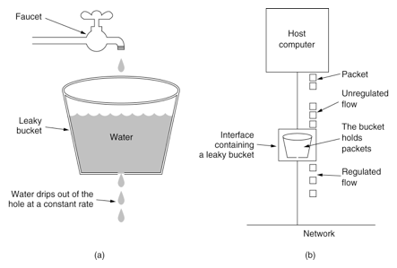

# Name

lua-resty-redis-countlimit - Limit the request processing number between multiple NGINX instances backed by [Redis](https://redis.io/).

# Table of Contents

* [Status](#status)
* [Description](#description)
* [Synopsis](#synopsis)
* [Methods](#methods)
    * [new](#new)
    * [incoming](#incoming)
* [Author](#author)
* [Copyright and License](#copyright-and-license)
* [See Also](#see-also)

# Status

Ready for testing. Probably production ready in most cases, though not yet proven in the wild. Please check the issues list and let me know if you have any problems / questions.

# Description

This lua library is a request processing counts limit module for ngx_lua:

http://wiki.nginx.org/HttpLuaModule

It is used to limit the request processing number per a defined key between multiple NGINX instances. The limitation is done using the "[leaky bucket](http://en.wikipedia.org/wiki/Leaky_bucket)" method.



This module use Redis (>= [2.6.0](http://redis.io/commands/eval)) as the backend storage, so you also need the [lua-resty-redis](https://github.com/openresty/lua-resty-redis) library work with it.


# Synopsis

````lua
lua_package_path "/path/to/lua-resty-redis-countlimit/lib/?.lua;;";

server {

    listen 9090;

    location /t {
        access_by_lua_block {
            local countlimit = require "resty.redis.countlimit"
            
            -- Allow 10 requests in 2 second 
            local lim, err = countlimit.new("one", 10, 2)
            if not lim then
                ngx.log(ngx.ERR,
                        "failed to instantiate a resty.redis.countlimit object: ", err)
                return ngx.exit(500)
            end

            -- NOTICE: the following call must be per-request.

            -- local redis = require "resty.redis"
            -- local red = redis:new()

            -- red:set_timeout(1000)

            -- local ok, err = red:connect("127.0.0.1", 6379)
            -- if not ok then
            --     ngx.log(ngx.ERR, "failed to connect redis: ", err)
            --     return ngx.exit(500)
            -- end

            local red = { host = "127.0.0.1", port = 6379, timeout = 1 }

            local key = ngx.var.binary_remote_addr
            local delay, err = lim:incoming(key, red)
            if not delay then
                if err == "rejected" then
                    return ngx.exit(503)
                end
                ngx.log(ngx.ERR, "failed to limit req: ", err)
                return ngx.exit(500)
            end

            if delay >= 0.001 then
                -- the 2nd return value holds the number of excess requests
                -- per second for the specified key.
                local excess = err

                ngx.sleep(delay)
            end
        '}

        echo Logged in;
    }

}
````

# Methods

[Back to TOC](#table-of-contents)

## new

**syntax:** `obj, err = class.new(zone, count, time_window)`

Instantiates an object of this class. The class value is returned by the call require `resty.redis.countlimit`.

This method takes the following arguments:

* `zone`: Sets the namespace, in particular, we use `<zone>:<key>` string as a unique state identifier inside Redis.

* `count` is the specified number of requests threshold.

* `time_window` is the time window in seconds before the request count is reset.

On failure, this method returns nil and a string describing the error.

[Back to TOC](#table-of-contents)

## incoming

**syntax:** `delay, err = obj:incoming(key, redis)`

Fires a new request incoming event and calculates the delay needed (if any) for the current request upon the specified key or whether the user should reject it immediately.

This method accepts the following arguments:

* `key`: The key is any non-empty value of the specified variable.
* `redis`: Sets the Redis configuration, `host`, `port`, `timeout` and so on (see below); Instead of the specific Redis configuration, you can also sets the connected Redis `object` directly.

```
- redis.host: Default 127.0.0.1.
- redis.port: Default 80.
- redis.timeout: Default 1s.
- redis.pass: Request for authentication in a password-protected Redis server.
- redis.dbid: Select the Redis logical database.
```

The return values depend on the following cases:

1. If the request does not exceed the `count` value specified in the [new](#new) method, then this method returns `0` as the delay and the remaining count of allowed requests at the current time (as the 2nd return value).
2. If the request exceeds the `count` limit specified in the [new](#new) method then this method returns `nil` and the error string `"rejected"`.
3. If an error occurred, then this method returns `nil` and a string describing the error. Such as `"failed to create redis - connection refused"`.

This method never sleeps itself. It simply returns a delay if necessary and requires the caller to later invoke the [ngx.sleep](https://github.com/openresty/lua-nginx-module#ngxsleep) method to sleep.

[Back to TOC](#table-of-contents)

# Author

Bean Shih <beanking77@gmail.com>

Inspired from https://github.com/openresty/lua-resty-limit-traffic/blob/master/lib/resty/limit/count.lua

[Back to TOC](#table-of-contents)

# Copyright and License

This module is licensed under the 2-clause BSD license.

Copyright (c) 2014 - 2017, Monkey Zhang <timebug.info@gmail.com>, UPYUN Inc.

All rights reserved.

Redistribution and use in source and binary forms, with or without modification, are permitted provided that the following conditions are met:

* Redistributions of source code must retain the above copyright notice, this list of conditions and the following disclaimer.

* Redistributions in binary form must reproduce the above copyright notice, this list of conditions and the following disclaimer in the documentation and/or other materials provided with the distribution.

THIS SOFTWARE IS PROVIDED BY THE COPYRIGHT HOLDERS AND CONTRIBUTORS "AS IS" AND ANY EXPRESS OR IMPLIED WARRANTIES, INCLUDING, BUT NOT LIMITED TO, THE IMPLIED WARRANTIES OF MERCHANTABILITY AND FITNESS FOR A PARTICULAR PURPOSE ARE DISCLAIMED. IN NO EVENT SHALL THE COPYRIGHT HOLDER OR CONTRIBUTORS BE LIABLE FOR ANY DIRECT, INDIRECT, INCIDENTAL, SPECIAL, EXEMPLARY, OR CONSEQUENTIAL DAMAGES (INCLUDING, BUT NOT LIMITED TO, PROCUREMENT OF SUBSTITUTE GOODS OR SERVICES; LOSS OF USE, DATA, OR PROFITS; OR BUSINESS INTERRUPTION) HOWEVER CAUSED AND ON ANY THEORY OF LIABILITY, WHETHER IN CONTRACT, STRICT LIABILITY, OR TORT (INCLUDING NEGLIGENCE OR OTHERWISE) ARISING IN ANY WAY OUT OF THE USE OF THIS SOFTWARE, EVEN IF ADVISED OF THE POSSIBILITY OF SUCH DAMAGE.

[Back to TOC](#table-of-contents)

# See Also

* Request count Limiting with openresty: https://github.com/openresty/lua-resty-limit-traffic/blob/master/lib/resty/limit/count.md
* the ngx_lua module: https://github.com/openresty/lua-nginx-module
* OpenResty: https://openresty.org/

[Back to TOC](#table-of-contents)
